# 🔄 TTS System Process Flow Documentation

## Tổng Quan Hệ Thống

Hệ thống TTS với Trí Tuệ Kinh Doanh là một hệ thống phức tạp bao gồm nhiều luồng xử lý song song và tích hợp. Tài liệu này mô tả chi tiết các quy trình và luồng dữ liệu chính.

## 🏗️ Kiến Trúc Tổng Quan

```
┌─────────────────┐    ┌─────────────────┐    ┌─────────────────┐
│   Client Layer  │    │   API Gateway   │    │   Service Layer │
│                 │    │   (Flask)       │    │                 │
│  • Web Apps     │    │  • Auth         │    │  • TTS Engine   │
│  • Mobile Apps  │◄──►│  • Rate Limit   │◄──►│  • BI Engine    │
│  • API Clients  │    │  • Validation   │    │  • File Handler │
└─────────────────┘    └─────────────────┘    └─────────────────┘
                                                    │
┌───────────────────────────────────────────────────┼───────────────────────────────────────────────────┐
│                 Data Processing Layer             │              Storage Layer                     │
│                                                   │                                               │
│  • Request Processing    • Response Generation    │  • PostgreSQL    • Redis Cache    • File Store │
│  • Audio Generation      • Analytics Collection   │  • User Data     • Session Data   • Audio Files │
│  • BI Calculations       • Report Generation      │  • BI Metrics    • Config Data    • Reports     │
└───────────────────────────────────────────────────┴───────────────────────────────────────────────────┘
```

## 📋 Quy Trình Xử Lý Chính

### 1. Quy Trình Xác Thực & Ủy Quyền

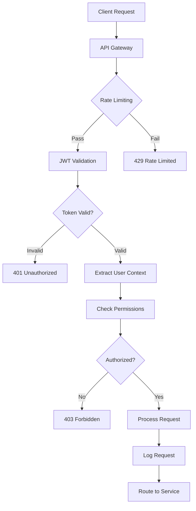

**Chi Tiết Quy Trình:**

1. **Rate Limiting**: Kiểm tra giới hạn yêu cầu dựa trên user tier
2. **JWT Validation**: Xác thực token và refresh token
3. **User Context**: Trích xuất thông tin user và organization
4. **Permission Check**: Kiểm tra quyền truy cập endpoint
5. **Request Logging**: Ghi log yêu cầu với thông tin bảo mật

### 2. Quy Trình Text-to-Speech

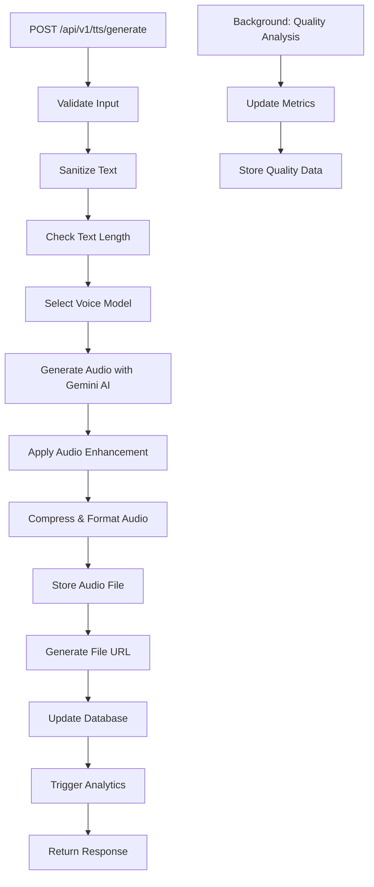

**Các Bước Chi Tiết:**

#### Validation Phase
- **Input Sanitization**: Loại bỏ HTML, scripts, kiểm tra encoding
- **Text Analysis**: Kiểm tra độ dài, ngôn ngữ, ký tự đặc biệt
- **Format Validation**: Xác thực các tham số audio (format, quality, voice)

#### Audio Generation Phase
- **Voice Selection**: Chọn mô hình giọng nói dựa trên preferences
- **Gemini AI Processing**: Gửi text đến Google Gemini API
- **Audio Enhancement**: Áp dụng noise reduction, normalization
- **Format Conversion**: Chuyển đổi sang định dạng yêu cầu

#### Storage & Response Phase
- **File Storage**: Lưu audio vào hệ thống file
- **Database Update**: Cập nhật metadata và tracking
- **Analytics Trigger**: Kích hoạt thu thập metrics
- **Response Generation**: Trả về URL và metadata

### 3. Quy Trình Trí Tuệ Kinh Doanh

#### Revenue Analytics Flow

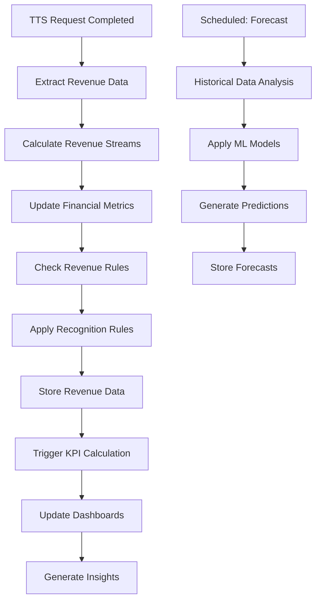

#### Customer Analytics Flow

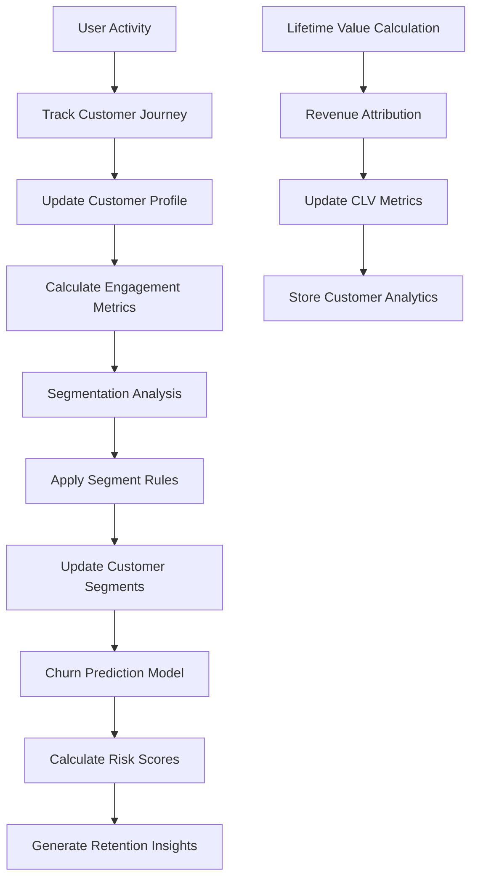

#### Usage Pattern Analysis Flow

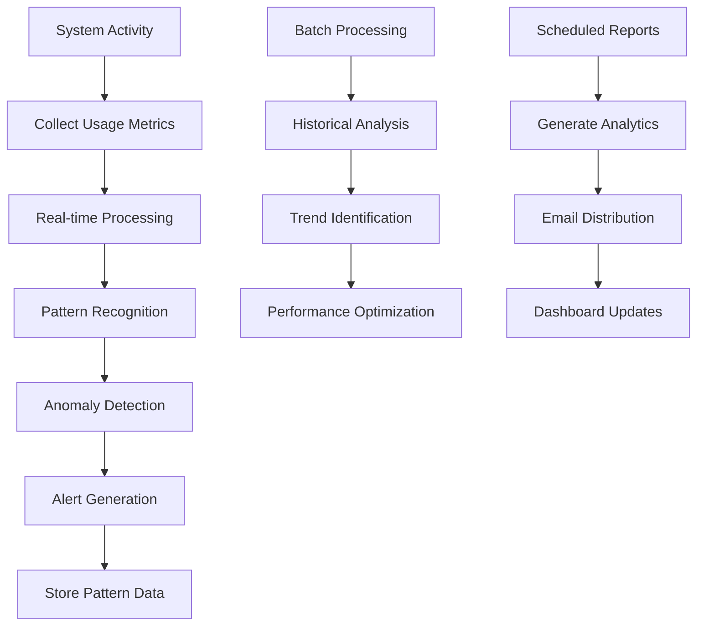

### 4. Quy Trình Batch Processing

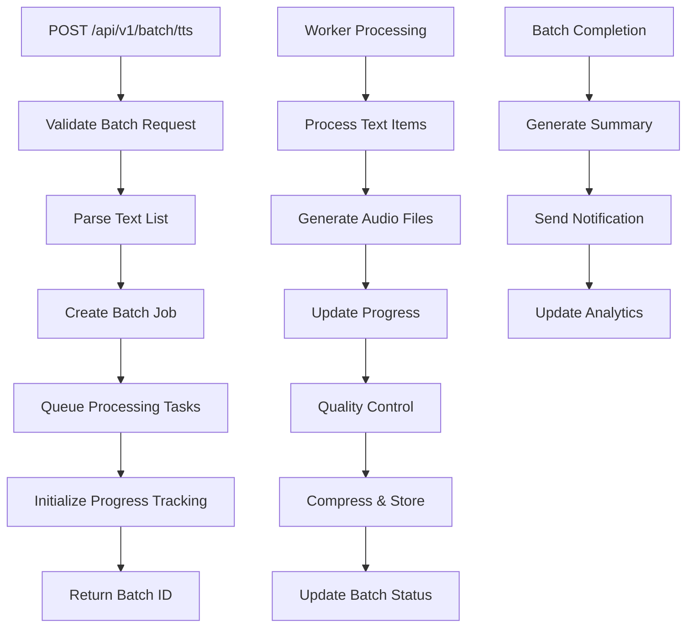

### 5. Quy Trình Voice Cloning

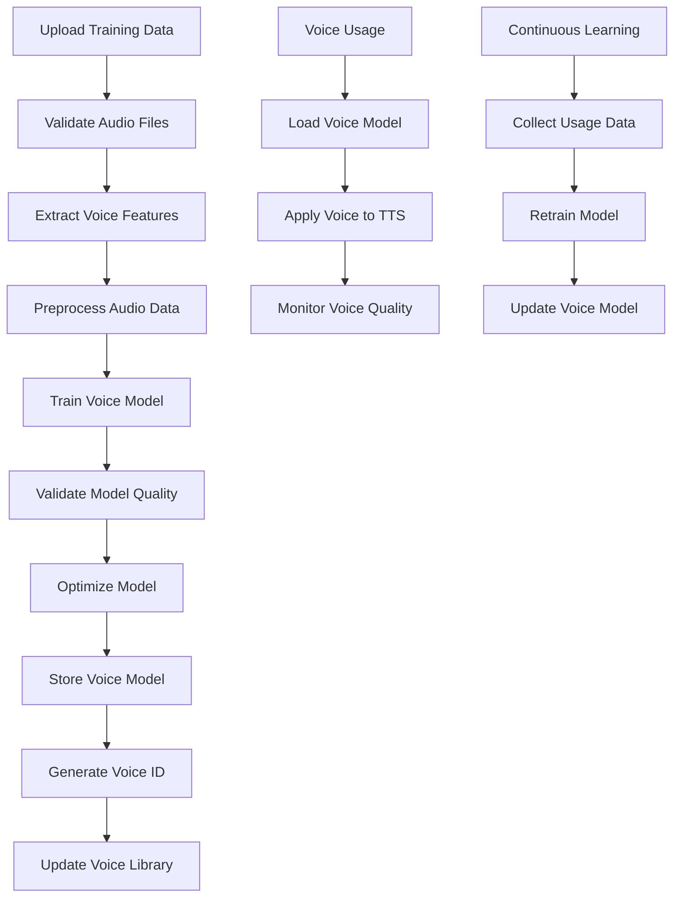

## 🔄 Luồng Dữ Liệu

### Real-time Data Flow

```
Client Request → API Gateway → Service Layer → External APIs
                                    ↓
Background Workers ← Queue System ← Async Tasks
                                    ↓
Database Updates ← Analytics Engine ← BI Processing
                                    ↓
Cache Updates ← Report Generation ← Dashboard Updates
```

### Batch Processing Flow

```
Batch Request → Validation → Queue → Worker Pool
                                    ↓
Parallel Processing → Quality Control → Storage
                                    ↓
Aggregation → Analytics → Reporting → Notifications
```

### Analytics Data Flow

```
Raw Events → Event Collector → Stream Processing
                                    ↓
Real-time Metrics → KPI Calculation → Alert System
                                    ↓
Batch Analytics → ML Models → Insights Generation
                                    ↓
Dashboard Updates → Report Generation → Email Delivery
```

## 📊 Xử Lý Phân Tích

### Real-time Analytics

1. **Event Collection**: Thu thập events từ tất cả endpoints
2. **Stream Processing**: Xử lý dữ liệu streaming với Apache Kafka/Redis Streams
3. **Real-time Metrics**: Tính toán metrics trong thời gian thực
4. **Alert Generation**: Tạo cảnh báo dựa trên ngưỡng định nghĩa
5. **Dashboard Updates**: Cập nhật dashboard với dữ liệu mới

### Batch Analytics

1. **Data Aggregation**: Tổng hợp dữ liệu từ nhiều nguồn
2. **Historical Analysis**: Phân tích xu hướng và patterns
3. **ML Model Training**: Đào tạo mô hình dự đoán
4. **Report Generation**: Tạo báo cáo toàn diện
5. **Insight Generation**: Tạo thông tin chi tiết kinh doanh

### Business Intelligence Pipeline

1. **Data Ingestion**: Nhập dữ liệu từ nhiều nguồn
2. **Data Cleaning**: Làm sạch và chuẩn hóa dữ liệu
3. **Feature Engineering**: Tạo features cho ML models
4. **Model Training**: Đào tạo và tối ưu hóa models
5. **Prediction Generation**: Tạo dự đoán và insights
6. **Visualization**: Tạo dashboard và reports

## 🔐 Xử Lý Bảo Mật

### Authentication Flow

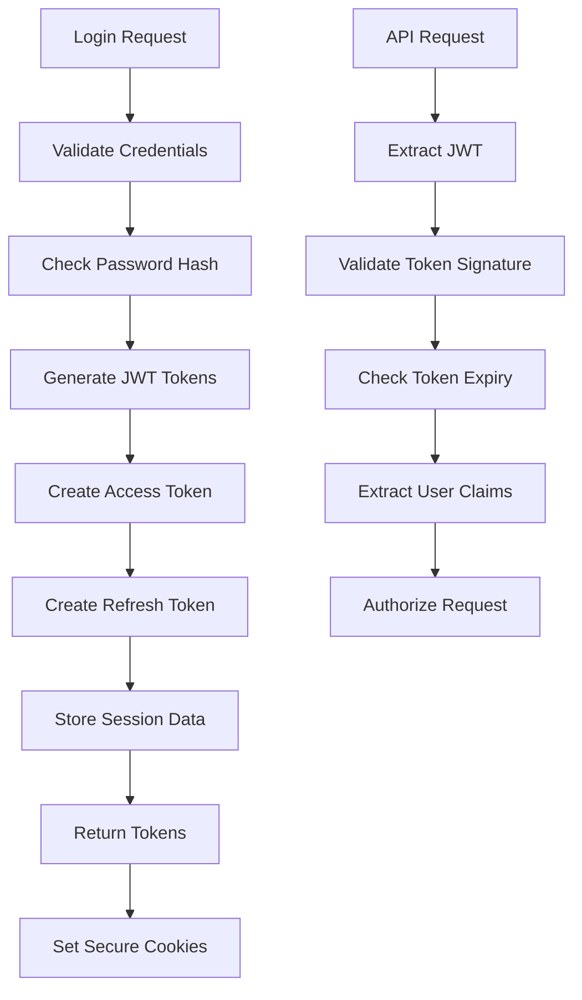

### Security Processing

1. **Input Validation**: Sanitize tất cả inputs
2. **SQL Injection Prevention**: Sử dụng parameterized queries
3. **XSS Protection**: Escape HTML và JavaScript
4. **CSRF Protection**: Validate origin và tokens
5. **Rate Limiting**: Áp dụng giới hạn dựa trên user tier
6. **Audit Logging**: Ghi log tất cả hoạt động bảo mật

## 🚀 Performance Optimization

### Caching Strategy

```
Hot Data (Frequently Accessed)
    ↓
Redis Cache (TTL: 1-24 hours)
    ↓
Application Cache (In-memory)
    ↓
Database (Persistent Storage)
```

### Load Balancing

```
Client Requests → Load Balancer → Application Servers
                                    ↓
Database Read Replicas ← Primary Database
                                    ↓
CDN → Static Assets → File Storage
```

### Scalability Patterns

1. **Horizontal Scaling**: Thêm nhiều instances
2. **Database Sharding**: Phân phối dữ liệu
3. **Queue-based Processing**: Async task processing
4. **Caching Layers**: Multiple cache levels
5. **CDN Integration**: Static asset delivery

## 📈 Monitoring & Alerting

### System Monitoring Flow

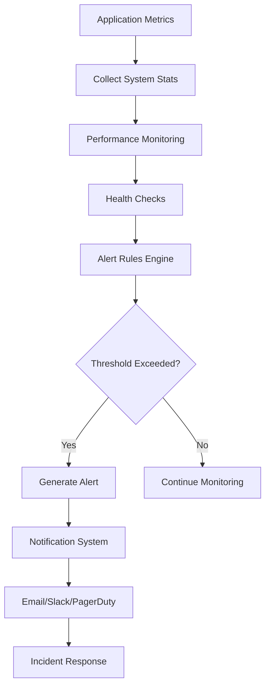

### Business Monitoring Flow

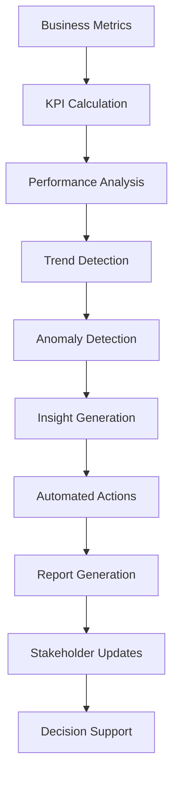

## 🔧 Error Handling & Recovery

### Error Processing Flow

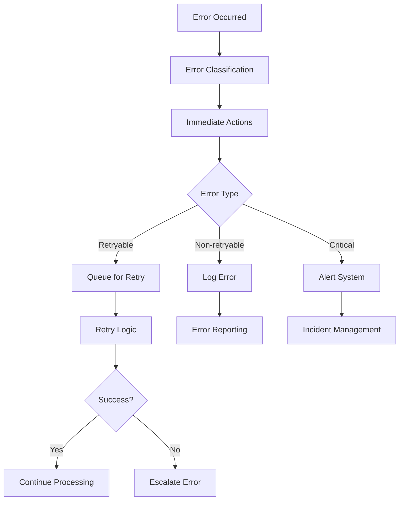

### Recovery Procedures

1. **Automatic Recovery**: Tự động retry failed operations
2. **Manual Recovery**: Dashboard để manual intervention
3. **Disaster Recovery**: Backup và restore procedures
4. **Incident Response**: Automated và manual response workflows

## 📋 API Request Lifecycle

### Complete Request Flow

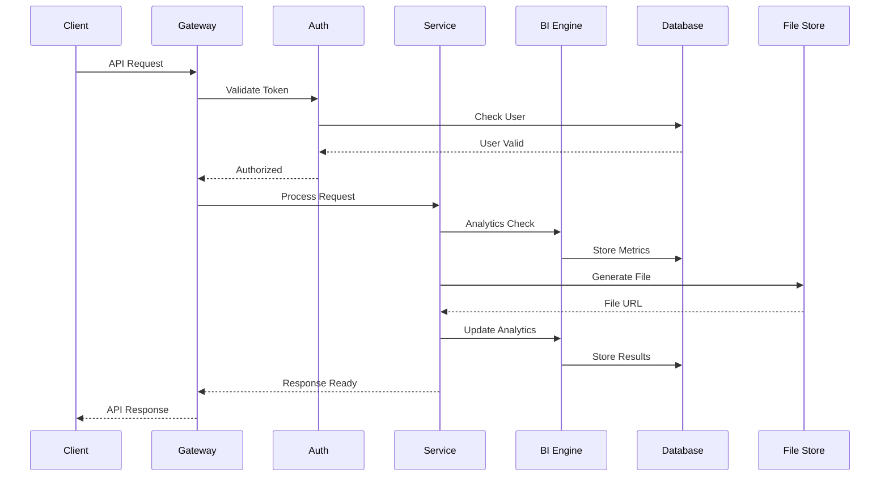

### Background Processing

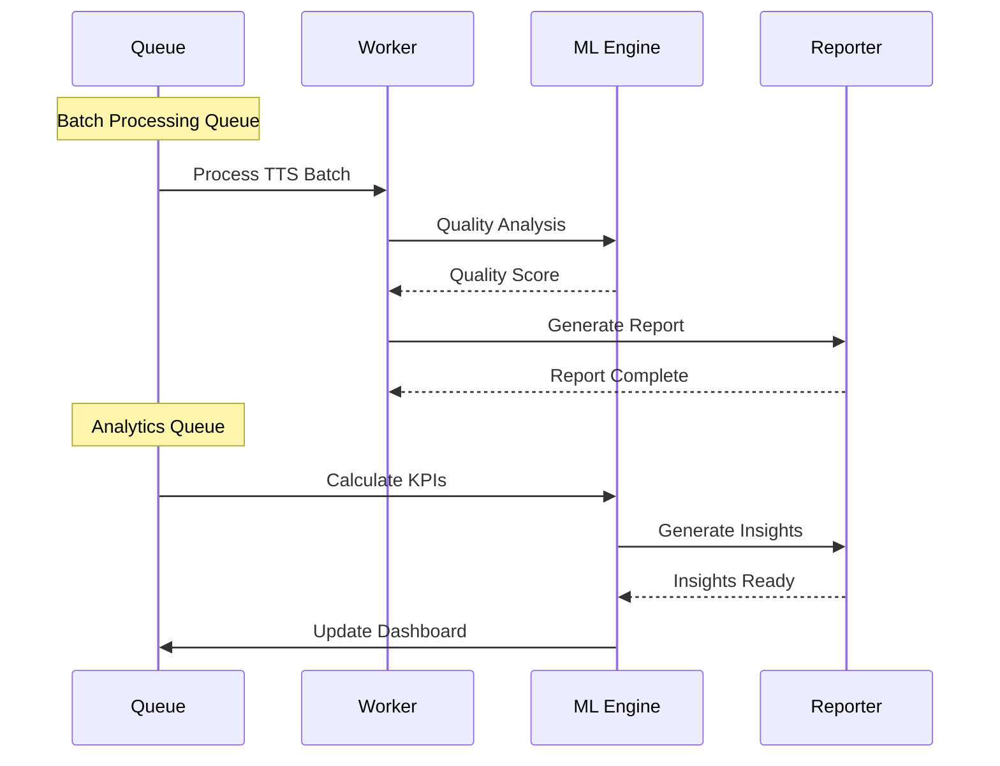

## 🎯 Best Practices

### Performance Optimization

1. **Caching Strategy**: Implement multi-level caching
2. **Database Optimization**: Sử dụng indexes và query optimization
3. **Async Processing**: Offload heavy tasks to background workers
4. **Resource Pooling**: Reuse database và API connections
5. **Compression**: Compress responses và static assets

### Security Measures

1. **Input Validation**: Validate tất cả inputs thoroughly
2. **Authentication**: Implement strong authentication mechanisms
3. **Authorization**: Use role-based access control
4. **Encryption**: Encrypt sensitive data at rest và in transit
5. **Monitoring**: Monitor for security threats và anomalies

### Reliability Engineering

1. **Health Checks**: Implement comprehensive health monitoring
2. **Circuit Breakers**: Prevent cascade failures
3. **Retry Logic**: Implement intelligent retry mechanisms
4. **Fallback Systems**: Provide graceful degradation
5. **Disaster Recovery**: Maintain backup và recovery procedures

---

*This process flow documentation provides a comprehensive overview of how the TTS system with Business Intelligence features operates, from initial request to final delivery and analytics processing.*