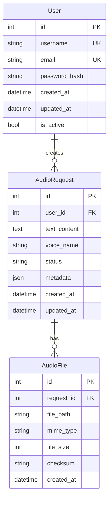

# Kế hoạch phát triển Flask TTS API

## Phân tích logic gốc
Từ file `ai_studio_code.py`, logic chính bao gồm:
- Sử dụng Google Gemini API để tạo audio từ text
- Hỗ trợ streaming response từ API
- Convert audio data thành WAV format
- Parse audio MIME type để lấy thông tin sample rate và bits per sample
- Save audio files ra disk

## Thiết kế API Endpoints
```
POST   /api/v1/auth/login              - Đăng nhập
POST   /api/v1/auth/register           - Đăng ký
POST   /api/v1/tts/generate            - Tạo audio từ text
GET    /api/v1/tts/{id}               - Lấy thông tin audio request
GET    /api/v1/tts/{id}/download      - Download file audio
GET    /api/v1/tts/                   - List audio requests (có phân trang)
DELETE /api/v1/tts/{id}               - Xóa audio request
GET    /api/v1/health                 - Health check
```

## Cấu trúc thư mục
```
flask_tts_api/
├── app/
│   ├── __init__.py          # Flask app factory
│   ├── main.py             # Application entry point
│   ├── config.py           # Configuration settings
│   └── extensions.py       # Flask extensions
├── routes/
│   ├── __init__.py
│   ├── auth.py             # Authentication routes
│   └── tts.py              # TTS API routes
├── models/
│   ├── __init__.py
│   ├── user.py             # User model
│   ├── audio_request.py    # AudioRequest model
│   └── audio_file.py       # AudioFile model
├── utils/
│   ├── __init__.py
│   ├── audio_processor.py  # Audio processing utilities
│   ├── security.py         # Security utilities
│   └── validators.py       # Data validation
├── tests/
│   ├── __init__.py
│   ├── test_auth.py
│   ├── test_tts.py
│   └── test_utils.py
├── docs/
│   ├── api_docs.md
│   └── setup_guide.md
├── config/
│   ├── development.py
│   ├── production.py
│   └── testing.py
├── .env.example
├── .dockerignore
├── Dockerfile
├── docker-compose.yml
├── requirements.txt
├── requirements-dev.txt
├── pyrightconfig.json
└── README.md
```

## Database Schema


## Công nghệ sử dụng
- **Flask**: Web framework
- **SQLAlchemy**: ORM
- **Flask-JWT-Extended**: JWT authentication
- **Pydantic**: Data validation
- **Flask-Limiter**: Rate limiting
- **Redis**: Caching và session storage
- **Flask-Caching**: Caching layer
- **Docker**: Containerization
- **PostgreSQL**: Database (production)
- **SQLite**: Database (development)

## Tính năng bảo mật
- JWT authentication với refresh tokens
- Rate limiting (100 requests/phút cho user thường, 1000 cho premium)
- Input sanitization và validation
- CORS configuration
- SQL injection prevention
- XSS protection
- CSRF protection

## Tính năng nâng cao
- Async processing cho TTS requests
- File upload/download với streaming
- Caching cho frequently requested audio
- Health monitoring dashboard
- Comprehensive logging
- API versioning
- Pagination cho list endpoints
- Error tracking và reporting